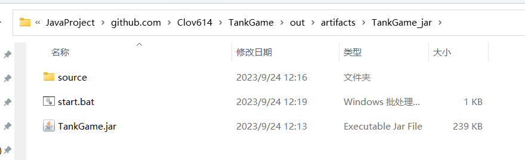
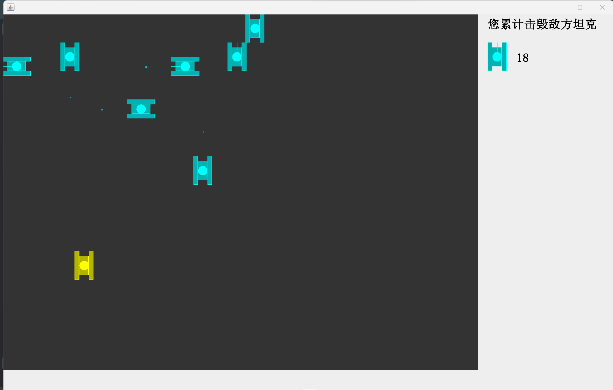

# Tank-Game

A simple demo of tank game by Java

Help me to improve Java code skill

# How to start this demo

### Step 1 

[Download the latestly jarPackage at Release](https://github.com/Clov614/Tank-Game/releases)

### Step 2 

[Download the source folder](https://minhaskamal.github.io/DownGit/#/home?url=https://github.com/Clov614/Tank-Game/tree/main/source) in the source code and place it in the same directory


### Step 3

Using the terminal Enter: `start java -jar TankGame.jar`

or

Builing the `start.bat` write: (Only windows)

```bash
start java -jar TankGame.jar
```

## Demo




